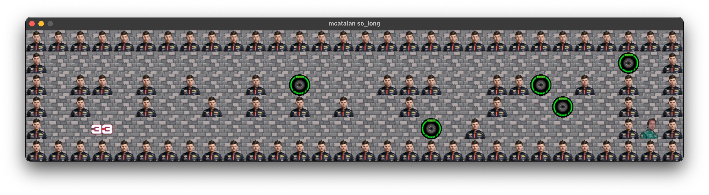

# so_long | mcatalan

<!-- 

	

 -->

### Table of Contents

* [English] (#english)
* [Game] (#game)
* [Introduction] (#introduction)
* [Spanish] (#spanish)
* [Juego] (#juego)
* [Introducción] (#introducción)

### English

## Game
You find yourself on the 28th of May 2023 at the Monaco Grand Prix also known as the Monte Carlo circuit. A legendary circuit where you will have to help Magic Alonso to win the #33 by collecting all the intermediate tyres and dodging Max Verstappen to win. Go Magic! You can do it Magic!

## Introduction
This project is a simple 2D game. The first graphic project where we'll start using the mlx library.

### Game Rules

### Español

## Juego
Te encuentras en el 28 de Mayo del 2023 en el Gran Premio de Monaco también conocido como circuito de Monte Carlo. Un circuito legendario donde tendrás que ayudar a Magic Alonso a ganar la #33 recogiendo todos los neumáticos intermedios y esquivando a Max Verstappen para ganar. Vamos Magic! Tu puedes Magic!

## Introducción
Este proyecto es un simple juego 2D. El primer proyecto gráfico donde empezaremos a usar la librería mlx.

## Reglas del juego